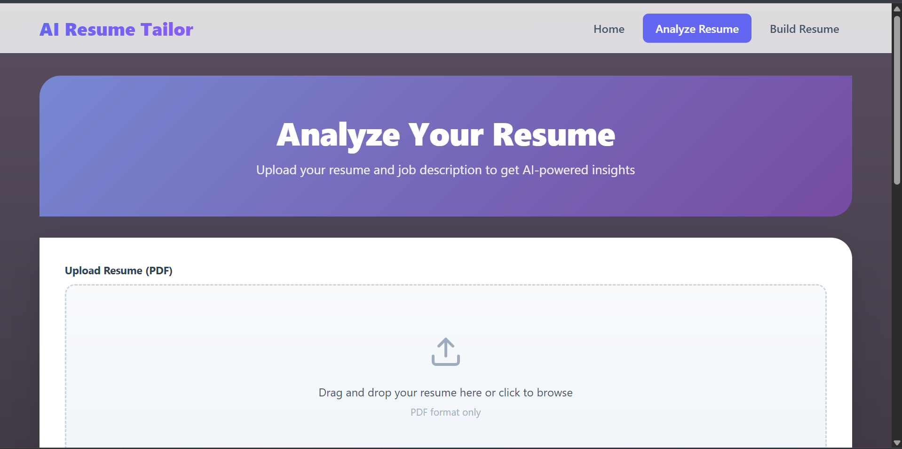
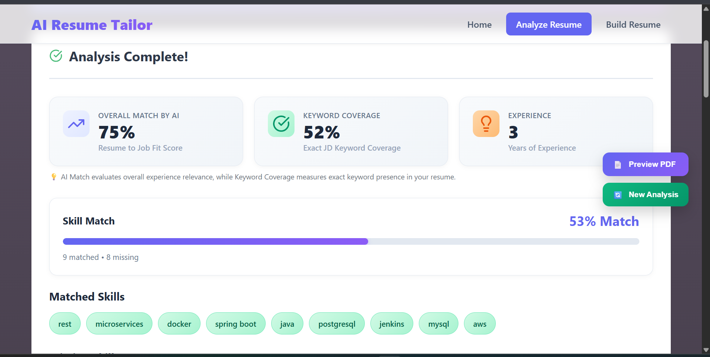
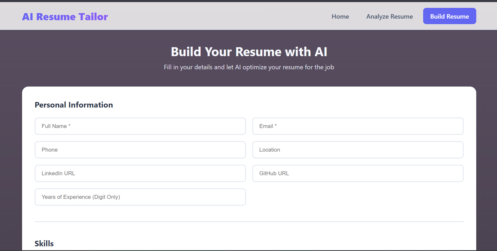
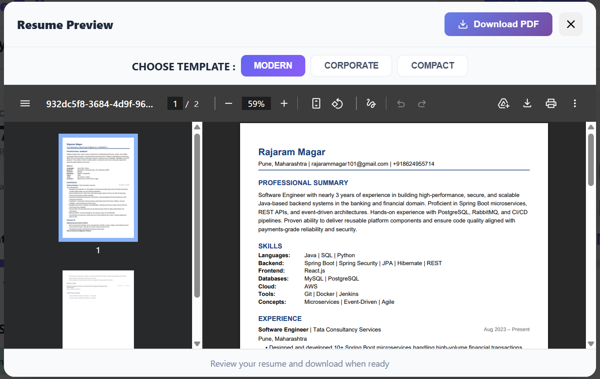

# AI Resume Tailor – React Frontend

AI Resume Tailor is a modern web application that helps job seekers analyze, optimize, and generate ATS-friendly resumes using AI.

The platform allows users to upload an existing resume, compare it against a job description, identify skill gaps, and generate tailored resumes using professional templates.

This repository contains the **React frontend** for the AI Resume Tailor application.

---

## Live Demo

Frontend  
https://ai-resume-tailor.vercel.app

Backend  
Spring Boot REST API

---

## Overview

AI Resume Tailor provides two main workflows:

1. Resume Analyzer – analyze an existing resume against a job description.  
2. Resume Builder – create a new resume from scratch with AI-assisted optimization.

The goal of the application is to help job seekers improve their resumes for **ATS systems and recruiter expectations**.

---

## Resume Analyzer

The Resume Analyzer allows users to upload a resume and compare it with a specific job description.

The application performs an AI-based analysis and generates insights including skill matching, experience summaries, and improvement suggestions.

Users can also generate a tailored resume PDF based on the analysis.

### Features

- Upload resume (PDF)
- Paste job description
- AI-powered resume analysis
- ATS compatibility insights
- Skill match detection
- Experience highlights
- Project summaries
- Resume improvement suggestions
- Generate optimized resume PDF

### Screenshot




---

## Resume Builder

The Resume Builder allows users to create a resume from scratch using an intuitive form-based interface.

Users can enter their details, skills, experience, projects, and education, and the system will generate a professional resume.

Optional job descriptions can be provided to tailor the resume content for specific roles.

### Features

- Personal information section
- Skills management
- Experience entries
- Project entries
- Education details
- Certifications section
- Dynamic form fields (add/remove entries)
- Job description targeting
- AI optimized content
- Resume generation with templates

### Screenshot




## Resume Templates

The application supports multiple resume templates that can be used to generate professional resumes.

Available templates include:

- Modern
- Corporate
- Compact

Users can preview the generated resume before downloading the final PDF.

### Screenshot



---

## Tech Stack

The frontend is built using modern web technologies.

**Frontend**

React 18  
React Router DOM  
Lucide React (icon library)  
CSS3 (custom responsive styling)

**Backend (separate repository)**

Java  
Spring Boot  
REST APIs  
AI / LLM integration  
PDF generation service

---

## Installation

### Prerequisites

Make sure the following tools are installed on your system.

Node.js version 16 or higher  
npm

The backend service should be running locally at: http://localhost:8080/

---

### Clone the Repository
git clone https://github.com/yourusername/ai-resume-tailor-frontend.git
cd ai-resume-tailor-frontend

---

### Install Dependencies
npm install

---

### Run Development Server
npm run dev

The application will run at: http://localhost:5173

---

## Project Structure
```
ai-resume-tailor-frontend
│
├── public
│ └── index.html
│
├── src
│ ├── components
│ │ ├── ResumeAnalyzer.jsx
│ │ ├── ResumeAnalyzer.css
│ │ ├── ResumeBuilder.jsx
│ │ ├── ResumeBuilder.css
│ │ ├── AnalysisResults.jsx
│ │ ├── AnalysisResults.css
│ │ ├── PDFPreview.jsx
│ │ ├── PDFPreview.css
│ │ ├── LoadingSpinner.jsx
│ │ └── LoadingSpinner.css
│ │
│ ├── App.jsx
│ ├── App.css
│ └── index.js
│
├── package.json
└── README.md
```

---

## API Integration

The frontend communicates with a Spring Boot backend using REST APIs.

### Resume Analysis
POST /api/v1/analyze


Parameters

- resumeFile (PDF)
- jobDescription (String)

Example Response
{
"analysisId": "uuid",
"resume": {
"header": {},
"summary": "",
"skills": {},
"experience": [],
"projects": [],
"education": [],
"certifications": []
}
}

---

### Resume Generation
POST /resume/generate

Request Body

Example Response

{
"analysisId": "uuid",
"resume": { ... }
}

---

### Resume PDF Generation

GET /api/v1/pdf/{analysisId}?template={MODERN|CORPORATE|COMPACT}

Response
application/pdf

---


## Responsive Design

The frontend is fully responsive and optimized for:

Desktop devices  
Tablets  
Mobile phones

---

## Future Improvements

Possible future improvements include:

- Resume keyword highlighting
- Resume scoring visualization
- LinkedIn profile import
- Additional resume templates
- Resume history tracking

---

## Disclaimer

This repository contains a personal project developed independently for learning and experimentation purposes.

This project is not affiliated with, endorsed by, or representing any employer or client organization of the author.

No proprietary code, confidential information, or internal resources from any employer were used in the development of this project.

All code and content in this repository are the author's own work.

---

Built with ❤️ using React and Spring Boot
